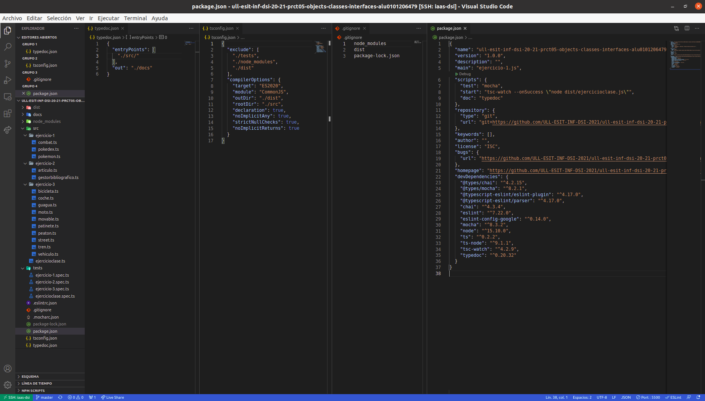
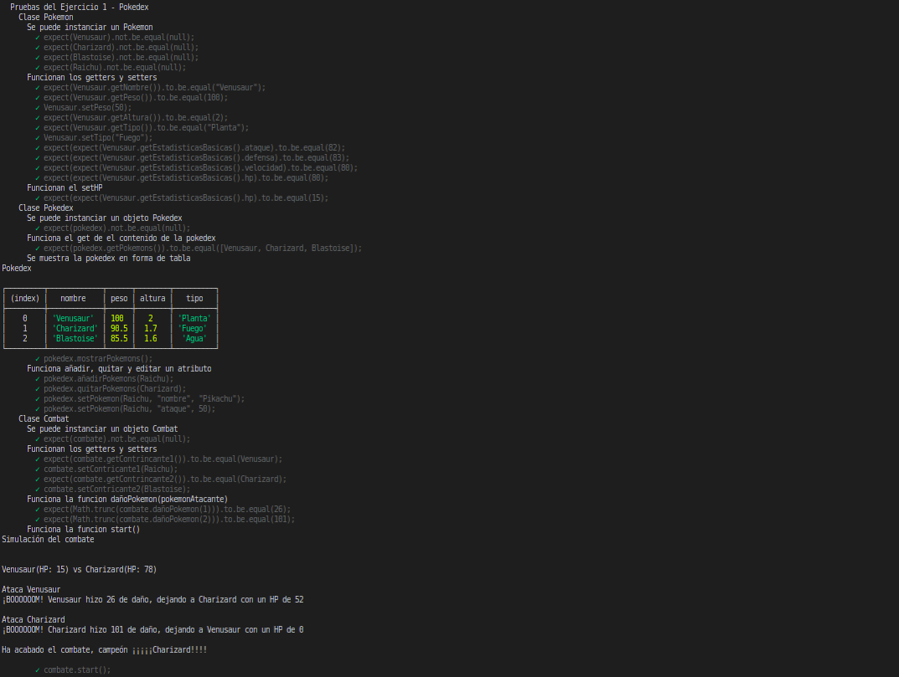
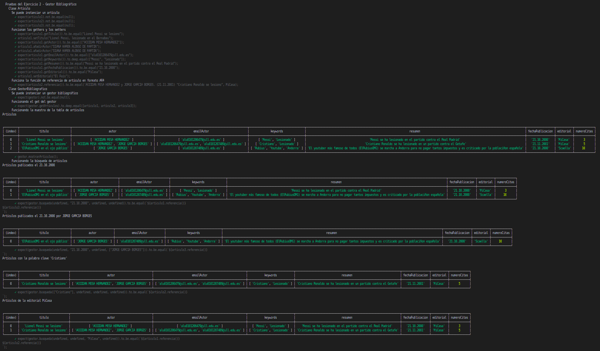

# Informe
## Práctica 5 - Objetos, clases e interfaces
### Desarrollo de Sistemas Informáticos
### ACOIDAN MESA HERNANDEZ - alu0101206479@ull.edu.es

#### Introducción
Esto es un informe para poder llevar a cabo la **práctica 5 de Desarrollo de Sistemas Informáticos**, hemos vuelto a crear una estructura de directorios adecuada (algo que ya sabíamos de la práctica anterior), pero añadiendole el uso del generador de documentación [TypeDoc](https://typedoc.org/) y el uso de [Mocha](https://mochajs.org/) (Marco de pruebas rico en funciones) con [Chai](https://www.chaijs.com/) (Librería de aserciones BDD / TDD para node y el navegador que se puede combinar con cualquier marco de pruebas JS o TS, en este caso lo hemos configurado con Mocha). 

A parte, como se ha llevado a cabo la metodología **TDD**, hemos reforzado nuestros conocimientos sobre ello una vez más. Y también hemos aprendido a utilizar **objetos, clases e interfaces** entre otras muchas herramientas. En este informe se mostrarán la resolución de los ejercicios y la explicación de estas soluciónes.

#### Objetivos
Los objetivos de esta práctica han sido crear la estructura de directorios adecuada para trabajar, añadiendole el generador de documentación TypeDoc y el uso del marco de pruebas Mocha con la libreria Chai. Pero lo principal ha sido resolver los 3 ejercicios que nos planteaban en el [enunciado](https://ull-esit-inf-dsi-2021.github.io/prct05-objects-classes-interfaces/), para así familiarizarnos más profundamente con TypeScript, en concreto con los objetos, clases e interfaces.

#### Crear la estructura básica y adecuada del proyecto, añadiendole el generador de documentación TypeDoc y el uso del marco de pruebas Mocha con la librería Chai.
Para crear la [estructura básica del proyecto](https://ull-esit-inf-dsi-2021.github.io/typescript-theory/typescript-project-setup.html), lo haremos como lo hicimos en la práctica anterior (Estará el enlace al informe de esta en la bibliografía), también podemos pinchar el hiperenlace adjuntado que se encontrará disponible también en la bibliografía.

Posteriormente, para configurar y aprender a usar el generador de configuración [TypeDoc](https://typedoc.org/) y el marco de pruebas [Mocha](https://mochajs.org/) con la librería [Chai](https://www.chaijs.com/) podremos consultar la documentación o pinchar en los siguientes hiperenlaces a vídeos explicativos (Estos enlaces también se encuentran en la bibliografía):

  * [Vídeo de ejemplo de instalación y configuración de TypeDoc en un proyecto TypeScript](https://drive.google.com/file/d/19LLLCuWg7u0TjjKz9q8ZhOXgbrKtPUme/view)
  * [Vídeo de ejemplo de instalación y configuración de Mocha y Chai en un proyecto TypeScript](https://drive.google.com/file/d/1-z1oNOZP70WBDyhaaUijjHvFtqd6eAmJ/view?usp=sharing)

Finalmente, nos tiene que quedar algo parecido a lo siguiente (Se muestra a la izquierda la estructura y en el medio algunos archivos abiertos para que se vea su interior):

#### Ejercicios
En cuanto a los ejercicios que se mostrarán a continuación, podemos ver sus respectivos enunciados [en el enunciado de la práctica 5](https://ull-esit-inf-dsi-2021.github.io/prct05-objects-classes-interfaces/). El código fuente de estos ejercicios deberá estar alojado en un directorio independiente con nombre `ejercicio-n/` dentro del directorio `src/` de nuestro proyecto. Dentro del directorio correspondiente de cada ejercicio debemos incluir cada clase desarrollada en un fichero independiente.

Cabe destacar que también se debe aportar la documentación mediante el uso de TypeDoc y usar una metodología de desarrollo dirigido por pruebas/comportamiento. El código fuente de las pruebas deberá estar alojado en un fichero independiente por ejercicio (`ejercicio-n.spec.ts`) dentro del directorio `tests/`.

##### Ejercicio 1 - Pokedex
En este ejercicio deberemos de crear las siguientes clases:
  * Clase Pokemon: Es la clase que representa a los Pokemons, su código lo podremos observar en el siguiente enlace:

      [ttps://github.com/ULL-ESIT-INF-DSI-2021/ull-esit-inf-dsi-20-21-prct05-objects-classes-interfaces-alu0101206479/blob/master/src/ejercicio-1/pokemon.ts](https://github.com/ULL-ESIT-INF-DSI-2021/ull-esit-inf-dsi-20-21-prct05-objects-classes-interfaces-alu0101206479/blob/master/src/ejercicio-1/pokemon.ts)
      
    Esta clase contendrá los siguientes atributos privados:     
      * `nombre`: Nombre del Pokemon (String) 
      * `peso`: Peso del Pokemon (Number) 
      * `altura`: Altura del Pokemon (Number) 
      * `tipo`: Tipo del Pokemon (String) 
      * `estadisticasBasicas`: Estadisticas básicas (ataque, defensa, velocidad, HP) del Pokemon (Propiedad)  

    Y contendrá las siguientes funciones públicas:
      * `getNombre()`: Función para obtener el atributo privado `nombre`
      * `setNombre(nombre: string)`: Función para cambiar el atributo privado `nombre`
      * `getPeso()`: Función para obtener el atributo privado `peso`
      * `setPeso(peso: number)`: Función para cambiar el atributo privado `peso`
      * `getAltura()`: Función para obtener el atributo privado `altura`
      * `setAltura(altura: number)`: Función para cambiar el atributo privado `altura`
      * `getTipo()`: Función para obtener el atributo privado `tipo`
      * `setTipo(tipo: string)`: Función para cambiar el atributo privado `tipo`
      * `getEstadisticasBasicas()`: Función para obtener el atributo privado `estadisticasBasicas`
      *  `setAtaque(ataque: number)`: Función para cambiar la propiedad `ataque` del atributo privado `estadisticasBasicas`
      *  `setDefensa(defensa: number)`: Función para cambiar la propiedad `defensa` del atributo privado `estadisticasBasicas`
      *  `setVelocidad(velocidad: number)`: Función para cambiar la propiedad `velocidad` del atributo privado `estadisticasBasicas`
      *  `setHP(hp: number)`: Función para cambiar la propiedad `hp` del atributo privado `estadisticasBasicas`

  * Clase Pokedex: Es la clase que representa a la Pokedex (Registro de todos los Pokemons), su código lo podremos observar en el siguiente enlace:

      [https://github.com/ULL-ESIT-INF-DSI-2021/ull-esit-inf-dsi-20-21-prct05-objects-classes-interfaces-alu0101206479/blob/master/src/ejercicio-1/pokedex.ts](https://github.com/ULL-ESIT-INF-DSI-2021/ull-esit-inf-dsi-20-21-prct05-objects-classes-interfaces-alu0101206479/blob/master/src/ejercicio-1/pokedex.ts)
      
    Esta clase contendrá el siguiente atributo privado
      * `pokemons`: Todos los Pokemons que tendrá la Pokédex (Pokemon[])

    Y contendrá las siguientes funciones públicas:
      * `getPokemons()`: Función para obtener el atributo privado `pokemons`
      * `añadirPokemons(pokemon: Pokemon)`: Función para añadir un Pokemon a la Pokedex (se añade con `push(pokemon)` un Pokemon al atributo `pokemons`.
      * `quitarPokemons(pokemon: Pokemon)`: Función para quitar un Pokemon de la Pokedex (se quita un Pokemon del atributo Pokemons).
      * `mostrarPokemons()`: Función para mostrar en una tabla los Pokemons de la Pokedex a través de `console.table`.
      * `setPokemon(pokemon: Pokemon, atributo: string, valor: string | number)`: Función para cambiar un atributo en concreto de un Pokemon en concreto (La función lo hace a través de condicionales con `typeof()`, guardianes de tipo y le entra el Pokemon al que se le quiere editar un atributo, el atributo que se le quiere cambiar al Pokemon y el nuevo valor que se le quiere poner al atrbiuto).

  * Clase Combat: Es la clase que representa un combate Pokemon, su código lo podremos observar en el siguiente enlace:

      [https://github.com/ULL-ESIT-INF-DSI-2021/ull-esit-inf-dsi-20-21-prct05-objects-classes-interfaces-alu0101206479/blob/master/src/ejercicio-1/combat.ts](https://github.com/ULL-ESIT-INF-DSI-2021/ull-esit-inf-dsi-20-21-prct05-objects-classes-interfaces-alu0101206479/blob/master/src/ejercicio-1/combat.ts)
      
    Esta clase contendrá los siguientes atributos privados:
      * `contrincante1`: Pokemon 1 del combate (Pokemon)
      * `contrincante2`: Pokemon 2 del combate (Pokemon)

    Y contendrá las siguientes funciones públicas:
      * `getContrincante1()`: Función para obtener el atributo privado `contrincante1`
      * `setContrincante1()`: Función para cambiar el atributo privado `contrincante1`
      * `getContrincante2()`: Función para obtener el atributo privado `contrincante2`
      * `setContrincante2()`: Función para cambiar el atributo privado `contrincante2`
      * `dañoPokemon(pokemonAtacante: number): number`: Función que calcula a través de un `switch` y condicionales el daño que causa un Pokemon a otro, le entra como parámetro un número que indica si ataca el Pokemon 1 o el Pokemon 2.
      * `start()`: Función que muestra por pantalla la simulación del combate primero, esto se hace a través de un bucle `while` que se va a ejecutar hasta que a uno de los dos Pokemons del combate se le acabe el hp (Primero ataca un Pokemon y después el otro).

Las pruebas de este ejercicio se pueden observar en el siguiente enlace:

  [https://github.com/ULL-ESIT-INF-DSI-2021/ull-esit-inf-dsi-20-21-prct05-objects-classes-interfaces-alu0101206479/blob/master/tests/ejercicio-1.spec.ts](https://github.com/ULL-ESIT-INF-DSI-2021/ull-esit-inf-dsi-20-21-prct05-objects-classes-interfaces-alu0101206479/blob/master/tests/ejercicio-1.spec.ts)
  
Y la salida de estas pruebas al ejecutar `npm run test` debería ser la siguiente:

  
  

##### Ejercicio 2 - Gestor bibliográfico
En este ejercicio deberemos de crear las siguientes clases:
  * Clase Articulo: Es la clase que representa articulos, su código lo podemos observar en el siguiente enlace:

      [https://github.com/ULL-ESIT-INF-DSI-2021/ull-esit-inf-dsi-20-21-prct05-objects-classes-interfaces-alu0101206479/blob/master/src/ejercicio-2/articulo.ts](https://github.com/ULL-ESIT-INF-DSI-2021/ull-esit-inf-dsi-20-21-prct05-objects-classes-interfaces-alu0101206479/blob/master/src/ejercicio-2/articulo.ts)
      
    Esta clase contendrá los siguientes atributos privados:     
      * `titulo`: Título del artículo (String) 
      * `autor`: Autor o autores del artículo (String[]) 
      * `emailAutor`: Email del autor o emails de los autores (String[]) 
      * `keywords`: Palabra o palabras clave del artículo (String[]) 
      * `resumen`: Resumen del artículo (String)
      * `fechaPublicacion`: Fecha en la que se publico el artículo (String)
      * `editorial`: Editorial del artículo (String)
      * `numeroCitas`: Numero de veces que se ha referenciado el artículo en otros trabajos (Number)

    Y contendrá las siguientes funciones públicas:
      * `getTitulo()`: Función para obtener el atributo privado `titulo`
      * `setTitulo(titulo: string)`: Función para cambiar el atributo privado `titulo`
      * `getAutor()`: Función para obtener el atributo privado `autor`
      * `añadirAutor(autor: string)`: Función para añadir un autor al artículo (se añade con `push(autor)` un autor al atributo `autor`.
      * `quitarAutor(autor: string)`: Función para quitar un autor del artículo (se quita un autor del atributo `autor`).
      * `getEmailAutor()`: Función para obtener el atributo privado `emailAutor`
      * `añadirEmailAutor(email: string)`: Función para añadir el email de un autor al artículo (se añade con `push(email)` el email de un autor al atributo `emailAutor`.
      * `quitarEmailAutor(email: string)`: Función para quitar el email de un autor del artículo (se quita el email de un autor del atributo `emailAutor`).
      * `getKeywords()`: Función para obtener el atributo privado `keywords`
      * `añadirKeyword(keyword: string)`: Función para añadir una palabra clave al artículo (se añade con `push(keyword)` la palabra clave al atributo `keywords`.
      * `quitarKeyword(keyword: string)`: Función para quitar una palabra clave del artículo (se quita una palabra clave del atributo `keywords`).
      * `getResumen()`: Función para obtener el atributo privado `resumen`
      * `setResumen(resumen: string)`: Función para cambiar el atributo privado `resumen`
      * `getFechaPublicacion()`: Función para obtener el atributo privado `fechaPublicacion`
      * `setFechaPublicacion(fechaPublicacion: string)`: Función para cambiar el atributo privado `fechaPublicacion
      * `getEditorial()`: Función para obtener el atributo privado `editorial`
      * `setEditorial(editorial: string)`: Función para cambiar el atributo privado `editorial`
      * `getNumeroCitas()`: Función para obtener el atributo privado `numeroCitas`
      * `setNumeroCitas(numeroCitas: number)`: Función para cambiar el atributo privado `numeroCItas`
      * `referencia()`: Función que devuelve la referencia del artículo en formato [APA para revista electrónica sin DOI](https://biblioguias.uam.es/citar/estilo_apa). Este formato es el siguiente **Autor o autores, (Fecha de publicación) Título, Editorial**. Esto lo podemos conseguir creando una cadena que va a ser la que se devolverá. En esta vamos introduciendo los autores con un bucle `forEach`, posteriormente la fecha de publicación del artículo, el título y finalmente la editorial.

  * Clase GestorBibliotecario: Es la clase que representa un gestor bibliográfico, su código lo podemos observar en el siguiente enlace:

      [https://github.com/ULL-ESIT-INF-DSI-2021/ull-esit-inf-dsi-20-21-prct05-objects-classes-interfaces-alu0101206479/blob/master/src/ejercicio-2/gestorbibliografico.ts](https://github.com/ULL-ESIT-INF-DSI-2021/ull-esit-inf-dsi-20-21-prct05-objects-classes-interfaces-alu0101206479/blob/master/src/ejercicio-2/gestorbibliografico.ts)
      
    Esta clase contendrá el siguiente atributo privado:     
      * `articulos`: Artículos que tendrá el gestor (Articulo[]) 

    Y contendrá las siguientes funciones públicas:
      * `getArticulos()`: Función para obtener el atributo privado `articulos`
      * `añadirArticulos(articulo: Articulo)`: Función para añadir un artículo al gestor bibliográfico (se añade con `push(articulo)` un artículo al atributo `articulos`.
      * `quitarArticulos(articulo: Articulo)`: Función para quitar un artículo del gestor bibliográfico (se quita un artículo del atributo `articulos`).
      * `mostrarArticulos()`: Función para mostrar los artículos en formato tabla, esto se hace con [console.table](https://developer.mozilla.org/es/docs/Web/API/Console/table) mostrando el atributo `articulos`.
      * `busqueda(palabraClave?: string[], fechaPublicacion?: string, editorial?: string, nombreAutor?: string[])`: Función que permite buscar artículos en el gestor por diversos parametros, muestra en formato tabla los artículos encontrados en la búsqueda y devuelve estos en formato de cita APA. A esta función le entran cuatro parametros opcionales, ya que se puede buscar por palabras clave, por fecha de publicación, por editorial o por nombre de autores, o incluso por varias de estas juntas. La búsqueda se realiza a través de un bucle `forEach` principal que recorre los artículos del gestor, y dentro de este se va a analizando si lo que se busca se encuentra en el artículo que se está analizando y si es así se introduce dicho articulo en el `array` de salida (Esto se hace a través de condicionales y de guardianes de tipo).

Las pruebas de este ejercicio se pueden observar en el siguiente enlace:

  [https://github.com/ULL-ESIT-INF-DSI-2021/ull-esit-inf-dsi-20-21-prct05-objects-classes-interfaces-alu0101206479/blob/master/tests/ejercicio-2.spec.ts](https://github.com/ULL-ESIT-INF-DSI-2021/ull-esit-inf-dsi-20-21-prct05-objects-classes-interfaces-alu0101206479/blob/master/tests/ejercicio-2.spec.ts)
  
Y la salida de estas pruebas al ejecutar `npm run test` debería ser la siguiente:

  

##### Ejercicio 3 - Medios de transporte
En este ejercicio deberemos de crear las siguientes clases e interfaces:
  * Interfaz Movable: Es la interfaz que representa la forma de cualquier objeto movible, su código lo podemos observar en el siguiente enlace:

      [https://github.com/ULL-ESIT-INF-DSI-2021/ull-esit-inf-dsi-20-21-prct05-objects-classes-interfaces-alu0101206479/blob/master/src/ejercicio-3/movable.ts](https://github.com/ULL-ESIT-INF-DSI-2021/ull-esit-inf-dsi-20-21-prct05-objects-classes-interfaces-alu0101206479/blob/master/src/ejercicio-3/movable.ts)
      
    Esta interfaz contendrá los siguientes atributos:     
      * `velocidad`: Velocidad a la que ira el objeto movible en km/h (Number) 
      * `tipo`: Tipo de objeto movible (String) 
      * `ruedas`: Número de ruedas del objeto movible (Number) 

    La interfaz no contiene funciones.
    
    
  * Clase Vehiculo: Es la clase que representa los vehículos y será la clase padre padre de todo tipo de ellos, su código lo podemos observar en el siguiente enlace:

      [https://github.com/ULL-ESIT-INF-DSI-2021/ull-esit-inf-dsi-20-21-prct05-objects-classes-interfaces-alu0101206479/blob/master/src/ejercicio-3/vehiculo.ts](https://github.com/ULL-ESIT-INF-DSI-2021/ull-esit-inf-dsi-20-21-prct05-objects-classes-interfaces-alu0101206479/blob/master/src/ejercicio-3/vehiculo.ts)
      
    Esta clase implementará la iterfaz Movable por lo que tendrá los atributos de esta y los declarará como públicos, por lo que no hace falta crear getters y setters para acceder a ellos.
    
    Cabe destacar que esta clase no dispone de ninguna función.
    

  * Clase Coche: Es una clase hija de la clase Vehiculo que representa a los coches, su código lo podemos observar en el siguiente enlace:

      [https://github.com/ULL-ESIT-INF-DSI-2021/ull-esit-inf-dsi-20-21-prct05-objects-classes-interfaces-alu0101206479/blob/master/src/ejercicio-3/coche.ts](https://github.com/ULL-ESIT-INF-DSI-2021/ull-esit-inf-dsi-20-21-prct05-objects-classes-interfaces-alu0101206479/blob/master/src/ejercicio-3/coche.ts)
      
    Esta clase al ser hija de la clase Vehiculo, se heredarán en el costructor a través de la función `super` todos los atributos de la clase padre (`velocidad`, `tipo`, `ruedas`).
    
    Cabe destacar que esta clase no dispone de ninguna función.
    
    
  * Clase Moto: Es una clase hija de la clase Vehiculo que representa a las motos, su código lo podemos observar en el siguiente enlace:

      [https://github.com/ULL-ESIT-INF-DSI-2021/ull-esit-inf-dsi-20-21-prct05-objects-classes-interfaces-alu0101206479/blob/master/src/ejercicio-3/moto.ts](https://github.com/ULL-ESIT-INF-DSI-2021/ull-esit-inf-dsi-20-21-prct05-objects-classes-interfaces-alu0101206479/blob/master/src/ejercicio-3/moto.ts)
      
    Esta clase al ser hija de la clase Vehiculo, se heredarán en el costructor a través de la función `super` todos los atributos de la clase padre (`velocidad`, `tipo`, `ruedas`).
    
    Cabe destacar que esta clase no dispone de ninguna función.
    
    
  * Clase Patinete: Es una clase hija de la clase Vehiculo que representa a los patinetes, su código lo podemos observar en el siguiente enlace:

      [https://github.com/ULL-ESIT-INF-DSI-2021/ull-esit-inf-dsi-20-21-prct05-objects-classes-interfaces-alu0101206479/blob/master/src/ejercicio-3/patinete.ts](https://github.com/ULL-ESIT-INF-DSI-2021/ull-esit-inf-dsi-20-21-prct05-objects-classes-interfaces-alu0101206479/blob/master/src/ejercicio-3/patinete.ts)
      
    Esta clase al ser hija de la clase Vehiculo, se heredarán en el costructor a través de la función `super` todos los atributos de la clase padre (`velocidad`, `tipo`, `ruedas`).
    
    Cabe destacar que esta clase no dispone de ninguna función.
    
    
  * Clase Tren: Es una clase hija de la clase Vehiculo que representa a los trenes, su código lo podemos observar en el siguiente enlace:

      [https://github.com/ULL-ESIT-INF-DSI-2021/ull-esit-inf-dsi-20-21-prct05-objects-classes-interfaces-alu0101206479/blob/master/src/ejercicio-3/tren.ts](https://github.com/ULL-ESIT-INF-DSI-2021/ull-esit-inf-dsi-20-21-prct05-objects-classes-interfaces-alu0101206479/blob/master/src/ejercicio-3/tren.ts)
      
    Esta clase al ser hija de la clase Vehiculo, se heredarán en el costructor a través de la función `super` todos los atributos de la clase padre (`velocidad`, `tipo`, `ruedas`).
    
    Cabe destacar que esta clase no dispone de ninguna función.
    
    
  * Clase Guagua: Es una clase hija de la clase Vehiculo que representa a las guaguas, su código lo podemos observar en el siguiente enlace:

      [https://github.com/ULL-ESIT-INF-DSI-2021/ull-esit-inf-dsi-20-21-prct05-objects-classes-interfaces-alu0101206479/blob/master/src/ejercicio-3/guagua.ts](https://github.com/ULL-ESIT-INF-DSI-2021/ull-esit-inf-dsi-20-21-prct05-objects-classes-interfaces-alu0101206479/blob/master/src/ejercicio-3/guagua.ts)
      
    Esta clase al ser hija de la clase Vehiculo, se heredarán en el costructor a través de la función `super` todos los atributos de la clase padre (`velocidad`, `tipo`, `ruedas`).
    
    Cabe destacar que esta clase no dispone de ninguna función.
    
    
  * Clase Bicicleta: Es una clase hija de la clase Vehiculo que representa a las bicicletas, su código lo podemos observar en el siguiente enlace:

      [https://github.com/ULL-ESIT-INF-DSI-2021/ull-esit-inf-dsi-20-21-prct05-objects-classes-interfaces-alu0101206479/blob/master/src/ejercicio-3/bicicleta.ts](https://github.com/ULL-ESIT-INF-DSI-2021/ull-esit-inf-dsi-20-21-prct05-objects-classes-interfaces-alu0101206479/blob/master/src/ejercicio-3/bicicleta.ts)
      
    Esta clase al ser hija de la clase Vehiculo, se heredarán en el costructor a través de la función `super` todos los atributos de la clase padre (`velocidad`, `tipo`, `ruedas`).
    
    Cabe destacar que esta clase no dispone de ninguna función.
    
    
  * Clase Peaton: Es una clase hija de la clase Vehiculo que representa a los peatones, su código lo podemos observar en el siguiente enlace:

      [https://github.com/ULL-ESIT-INF-DSI-2021/ull-esit-inf-dsi-20-21-prct05-objects-classes-interfaces-alu0101206479/blob/master/src/ejercicio-3/peaton.ts](https://github.com/ULL-ESIT-INF-DSI-2021/ull-esit-inf-dsi-20-21-prct05-objects-classes-interfaces-alu0101206479/blob/master/src/ejercicio-3/peaton.ts)
      
    Esta clase al ser hija de la clase Vehiculo, se heredarán en el costructor a través de la función `super` todos los atributos de la clase padre (`velocidad`, `tipo`, `ruedas`).
    
    Cabe destacar que esta clase no dispone de ninguna función.
    
    
  * Clase Street: Es la clase que representa una calle, su código lo podemos observar en el siguiente enlace:

      [https://github.com/ULL-ESIT-INF-DSI-2021/ull-esit-inf-dsi-20-21-prct05-objects-classes-interfaces-alu0101206479/blob/master/src/ejercicio-2/street.ts](https://github.com/ULL-ESIT-INF-DSI-2021/ull-esit-inf-dsi-20-21-prct05-objects-classes-interfaces-alu0101206479/blob/master/src/ejercicio-2/street.ts)
      
    Esta clase contendrá los siguientes atributos privados:     
      * `nombre`: Nombre de la calle (String) 
      * `localizacion`: Localización de la calle (String) 
      * `vehiculosCirculando`: Vehículos circulando en la calle (Vehiculo[]) 

    Y contendrá las siguientes funciones públicas:
      * `getNombre()`: Función para obtener el atributo privado `nombre`
      * `setNombre(nombre: string)`: Función para cambiar el atributo privado `nombre`
      * `getLocalizacion()`: Función para obtener el atributo privado `localizacion`
      * `setLocalizacion(localizacion: string)`: Función para cambiar el atributo privado `localizacion`
      * `getVehiculos()`: Función para obtener el atributo privado `vehiculosCirculando`
      * `añadirVehiculo(vehiculo: Vehiculo)`: Función para añadir un vehículo a la calle (se añade con `push(vehiculo)` un vehículo al atributo `vehiculosCirculando`.
      * `quitarVehiculo(vehiculo: Vehiculo)`: Función para quitar un vehículo de la calle (se quita un vehiculo del atributo `vehiculosCirculando`).
      * `cantidadVehiculos()`: Función que muestra la cantidad de vehículos de cada tipo que hay en la calle en cada momento en formato de tabla. Esto se hace con un `array de arrays de pares` en el que la primera posicion de cada sub-array representa cada tipo de vehículo y la segunda el número de vehículos de ese tipo que hay circulando (que hay en el atributo `vehiculosCirculando`). Para ir incrementando dicho número, a través de un bucle `forEach` recorremos el atributo `vehiculosCirculando`, y con la funcion `instanceof` y condicionales hacemos que se incremente el número de la segunda posición del sub-array en el que se encuentre el tipo de vehículo que estamos analizando como primera posición.
      * `velocidad()`: Función que muestra los vehiculos de la calle ordenados por la velocidad a la que circulan en formato tabla. Esto se hace con la función `console.table(this.vehiculosCirculando.sort(((a, b) => b.velocidad - a.velocidad)));`.

Las pruebas de este ejercicio se pueden observar en el siguiente enlace:

  [https://github.com/ULL-ESIT-INF-DSI-2021/ull-esit-inf-dsi-20-21-prct05-objects-classes-interfaces-alu0101206479/blob/master/tests/ejercicio-3.spec.ts](https://github.com/ULL-ESIT-INF-DSI-2021/ull-esit-inf-dsi-20-21-prct05-objects-classes-interfaces-alu0101206479/blob/master/tests/ejercicio-3.spec.ts)
  
Y la salida de estas pruebas al ejecutar `npm run test` debería ser la siguiente:

  

#### Conclusiones
Como conclusión a la práctica, me ha parecido bastante interesante familiarizarnos con el uso de clases, objetos e interfaces en TypeScript. No me ha costado mucho debido a que en el lenguaje de programación **C++** ya había tocado con ellas anteriormente y el hecho de entenderlas es practicamente igual.

Poco a poco viendo diversos artículos me voy dando cuenta de que TypeScript es muy útil en la actualidad y me alegra mucho aprender a usarlo cada vez más.

#### Bibliografía

Nombre | Enlaces
-------|--------
Enunciado de la práctica | https://ull-esit-inf-dsi-2021.github.io/prct05-objects-classes-interfaces/
Apuntes de la asignatura | https://ull-esit-inf-dsi-2021.github.io/typescript-theory/
TypeDoc | https://typedoc.org/
Mocha | https://mochajs.org/
Chai | https://www.chaijs.com/
Tutorial de creación de la estructura básica del proyecto | https://ull-esit-inf-dsi-2021.github.io/typescript-theory/typescript-project-setup.html
Vídeo de ejemplo de instalación y configuración de TypeDoc en un proyecto TypeScript | https://drive.google.com/file/d/19LLLCuWg7u0TjjKz9q8ZhOXgbrKtPUme/view
Repositorio GitHub con el ejemplo de configuración de TypeDoc en un proyecto TypeScript | https://github.com/ULL-ESIT-INF-DSI-2021/doc-test
Vídeo de ejemplo de instalación y configuración de Mocha y Chai en un proyecto TypeScript | https://drive.google.com/file/d/1-z1oNOZP70WBDyhaaUijjHvFtqd6eAmJ/view
Repositorio GitHub con el ejemplo de configuración de Mocha y Chai en un proyecto TypeScript | https://github.com/ULL-ESIT-INF-DSI-2021/doc-test
Tutorial sobre depuración de TypeScript en Visual Studio Code | https://code.visualstudio.com/docs/typescript/typescript-debugging
Principio SOLID | https://samueleresca.net/solid-principles-using-typescript/
Complete Pokémon Pokédex | https://pokemondb.net/pokedex/all
APA para revista electrónica sin DOI | https://biblioguias.uam.es/citar/estilo_apa
console.table | https://developer.mozilla.org/es/docs/Web/API/Console/table
Ejemplo de artículo 1 | https://link.springer.com/article/10.1007%2Fs10479-019-03290-3
Ejemplo de artículo 2 | https://link.springer.com/article/10.1007%2Fs10479-018-2970-4
Ejemplo de artículo 3 | https://www.sciencedirect.com/science/article/pii/S0360835220306264?via%3Dihub
Ejemplo de artículo 4 | https://www.tandfonline.com/doi/abs/10.1080/08839514.2020.1842627?journalCode=uaai20
Ejemplo de artículo 5 | https://ieeexplore.ieee.org/document/9310180
Ejemplo de artículo 6 | https://ieeexplore.ieee.org/document/9314000
Ejemplo de artículo 7 | https://ieeexplore.ieee.org/document/9312045
Ejemplo de artículo 8 | https://www.mdpi.com/1999-4893/14/1/21
Ejemplo de artículo 9 | https://ieeexplore.ieee.org/document/9245472

